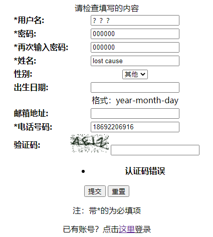
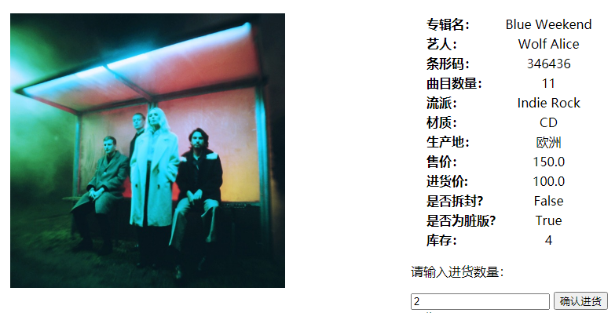

# Database Project Report
##### All By: 陈俊含 19307130180
***
### 实验题目
**唱片店管理系统的设计与实现**

### 实验背景
唱片是音乐的一种承载物，最初的形态为黑胶唱片，后来逐渐有了 CD 唱片。唱片作为一种文化符号和艺术载体，其价值不言而喻，唱片店也成为了一座城市文化气息的反映。唱片文化曾在中国风靡一时，但随着互联网技术的逐步发展，数字媒介挤兑了唱片的生存空间，唱片店的生存环境逐渐恶化，亟需从原本只有实体店的模式改为线上+线下的双渠道模式，这就需要专为其设计的数据库来管理唱片。

### 开发环境
- 操作系统：Windows 10
- 数据库管理软件：pgAdmin 4.30
- 编程语言：Django 3.2, Python3, HTML, CSS, PostgreSQL 13
- 开发环境：Visual Studio Code, localhost

### 数据库设计
- ER图  
  

- auth_user表
 - 功能：储存数据库管理员（即店长）的相关信息

 - 属性及其说明：  
   **<u>id</u>**：integer, primarykey, not null  
   **password**：character varying(128), not null, using MD5  
   **last_login**：timestamp with time zone  
   **is_superuser**：boolean, not null  
   **username**：character varying(150), unique, not null  
   **name**：character varying(150), not null  
   **email**：character varying(254), not null  
   **is_staff**：boolean, not null  
   **is_active**：boolean, not null  
   **date_joined**：timestamp with time zone, not null

 - 内容展示（由于属性过多故仅展示部分）：
   

- user表
 - 功能：存储注册用户的个人信息

 - 属性及其说明：  
   **<u>username</u>**：character varying(128), primarykey, not null  
   **password**：character varying(256), not null, using MD5  
   **name**：character varying(128), not null  
   **sex**：character varying(32)  
   **birthday**：date  
   **email**：character varying(128)  
   **tel**：character varying(15), not null  
   *order by username*

  - 内容展示（由于属性过多故仅展示部分）：
    

- cd表
 - 功能：存储CD唱片的详细信息

 - 属性及其说明：  
   **<u>id</u>**：integer, primarykey, not null  
   **barcode**：character varying(13), not null  
   **name**：character varying(128), not null  
   **artist**：character varying(128)  
   **cover**：character varying(100), not null  
   **number**：integer  
   **genre**：character varying(128)  
   **produce_area**：character varying(128), not null  
   **price**：double precision, not null  
   **cost**：double precision, not null  
   **seal_off**：boolean, not null  
   **explicit**：boolean, not null  
   **remain**：integer, not null
   *unique(barcode, produce_area, cost)*

  - 内容展示（由于属性过多故仅展示部分）：  
    

- vinyl表
 - 功能：存储黑胶唱片的详细信息

 - 属性及其说明：  
   **<u>id</u>**：integer, primarykey, not null  
   **barcode**：character varying(13), not null  
   **name**：character varying(128), not null  
   **artist**：character varying(128)  
   **cover**：character varying(100), not null  
   **number**：integer  
   **genre**：character varying(128)  
   **produce_area**：character varying(128), not null  
   **price**：double precision, not null  
   **cost**：double precision, not null  
   **second_hand**：boolean, not null  
   **remain**：integer, not null
   *unique(barcode, produce_area, cost)*

  - 内容展示（由于属性过多故仅展示部分）：  
    

- orderlist表
 - 功能：记录店长的进货订单信息

 - 属性及其说明：  
   **<u>id</u>**：integer, primarykey, not null  
   **time**：timestamp with time zone, not null  
   **status**：character varying(5), not null  
   **mark**：boolean, not null  
   **cd**：boolean, not null  
   **amount**：integer, not null  
   **cost**：double precision, not null, foreignkey(cd/vinyl)  
   **tar**：integer, not null, foreignkey(cd.id/vinyl.id)  
   **name**：character varying(128), not null, foreignkey(cd/vinyl)  
   **produce_area**：character varying(128), not null, foreignkey(cd/vinyl)

  - 内容展示（由于属性过多故仅展示部分）：  
    

- userorder表
 - 功能：记录用户的订购订单

 - 属性及其说明：  
   **<u>id</u>**：integer, primarykey, not null  
   **time**：timestamp with time zone, not null  
   **cd**：boolean, not null  
   **amount**：integer, not null  
   **cost**：double precision, not null, foreignkey(cd/vinyl)  
   **total**：double precision, not null  
   **tar**：integer, not null, foreignkey(cd.id/vinyl.id)  
   **username**：character varying(128), not null, foreignkey(user)  

  - 内容展示：  
    

- auth_group表
 - 功能：记录管理员组的信息

 - 属性及其说明：  
   **<u>id</u>**：integer, primarykey, not null  
   **name**：character varying(150), unique, not null  

  - Django自动创建，用于后台管理

- auth_group_permissions表
 - 功能：记录管理员组的权限信息

 - 属性及其说明：  
   **<u>id</u>**：bigint, primarykey, not null  
   **group_id**：integer, unique, not null, foreignkey(auth_group.id)  
   **permission_id**：integer, unique, not null, foreignkey(auth_permissions.id)

  - Django自动创建，用于后台管理

- auth_permissions表
 - 功能：记录整个项目的权限需求信息

 - 属性及其说明：  
   **<u>id</u>**：integer, primarykey, not null  
   **name**：character varying(255), not null  
   **content_type_id**：integer, unique, not null, foreignkey(django_content_type.id)
   **codename**：character varying(100), unique, not null  

  - 内容展示：  
    

  - Django自动创建，用于后台管理

- captcha_captchastore表
 - 功能：记录有效期已过的验证码

 - 属性及其说明：  
   **<u>id</u>**：bigint, primarykey, not null  
   **challenge**：character varying(32), not null  
   **response**：character varying(32), not null  
   **hashkey**：character varying(40), unique, not null  
   **expiration**：timestamp with time zone, not null  

  - 内容展示：  
    

- django_content_type表
 - 功能：记录项目中的所有模型名

 - 属性及其说明：  
   **<u>id</u>**：integer, primarykey, not null  
   **app_label**：character varying(100), unique, not null  
   **model**：challenge varying(100), unique, not null

  - 内容展示：  
    

### 系统设计
- 主页面
 - 说明：几乎所有的非法访问都会被转到此页面，登录成功或者退出账号时也会跳转到这里

 - 界面：  
   未登录时的主页界面：  
     
   登陆后的主页界面：  
   

 - 源码分析：mainpage.html index()
 ```
 mainpage.html:
    导航栏：
            //登录后显示以下界面
          <a>当前在线：</a><br>
          <a> {{ user.name }} </a><br><br>
          <a href="/self/">个人主页</a>><br><br>
          <a href="/querycd">唱片查询</a>><br><br>
          <a href="/top10">热销榜top10</a>><br><br>
          <a href="/logout/">退出账号</a>><br><br>
                                   //未登录则显示以下界面
          <a href='/login'>登录</a>><br><br>
          <a href="/register">注册</a>><br><br>
    
    图片动态滚动：
    <MARQUEE onmouseover=stop() onmouseout=start() direction="left" scrollAmount="15" loop=infinite deplay="5">
          
          ...
    </MARQUEE>
 index():
 def index(request):
    if request.session.get('is_login'):   #若登录
       user = models.User.objects.get(username=request.session.get('user_name'))
    return render(request,'mainpage.html', locals())
 ```

- 注册
 - 说明：顾名思义，加上了验证码机制防止被恶意注册大量账号，注册成功会跳转到登录界面

 - 界面：  
   

 - 测试：  
   输入的用户名已存在：  
     
   两次输入的密码不同：  
     
   必填项未填：  
     
   验证码填写错误：  
   

 - 源码分析：registration.html register()
   ```
   def register(request):
      if request.session.get('is_login', None): # 登录状态不允许注册
         return redirect("/")
      register_form = RegisterForm()
      if request.method == "POST":
         register_form = RegisterForm(request.POST)
         if register_form.is_valid():  # 获取数据
            username = register_form.cleaned_data['username']
            ...
            if register_form.cleaned_data['sex']:
                sex = register_form.cleaned_data['sex']
            else:
                sex = None
            ...
            if password1 != password2:  # 判断两次密码是否相同
                message = "两次输入的密码不同！"
                return render(request, 'registration.html', locals())
            else:
                check = models.User.objects.filter(username=username)
                if check:
                    message = '用户名已经存在，请重新选择用户名！'
                    return render(request, 'registration.html', locals())
                #加密密码
                md5 = hashlib.md5()
                md5.update(password1.encode())
                password_md5 = md5.hexdigest()
                models.User.objects.create(...)
                return redirect('/login/')  # 自动跳转到登录页面
         else:
            message = "请检查填写的内容"
      return render(request, 'registration.html', locals())
   ```

- 登录
  - 说明：顾名思义，登录成功后转到个人主页

  - 界面：  
    

  - 测试：  
    用户名不存在：  
      
    密码错误：  
    

  - 源码分析：admin.html login()
    ```
    def login(request):
       if request.session.get('is_login', None):  #不重复登录
          return redirect('/')
       if request.method == "POST":
          login_form = UserForm(request.POST)
          if login_form.is_valid():
             username = login_form.cleaned_data['username']
             ...
             try:
                user = models.User.objects.get(username=username)
                if user.password == password_md5:   #密码正确，创建session值
                    request.session['is_login'] = True
                    request.session['user_name'] = user.username
                    if user.username=="brayton":
                        request.session['is_admin'] = True
                    else:
                        request.session['is_admin'] = False
                    return redirect('/index/')
                else:
                    message = "密码不正确！"
             except:
                message = "用户名不存在！"
          message = "请检查填写的内容"
          return render(request, './admin.html', locals())
       login_form = UserForm()
       return render(request,'admin.html', locals())
    ```

- 个人主页
 - 说明：显示个人详细信息以及功能导航栏

 - 界面：  
   用户的个人主页：  
     
   店长的个人主页，会发现左侧导航栏与用户的不同：  
   

 - 源码分析：selfpage.html self()
   ```
   selfpage.html:
        //店长才能访问的功能
        <a href="/orderlist">我的订单</a>><br><br>
        <a href="/userorder">客户订单</a>><br><br>
        <a href="/queryuser">查看客户资料</a>><br><br>
                               //用户能够访问的功能
        <a href="/userorder">订单查询</a>><br>
   
   self():
   def self(request):
      if request.session.get('is_login'):   #登录才能访问
         user = models.User.objects.get(username=request.session.get('user_name'))
         return render(request, "selfpage.html", locals())
      return redirect('/')
   ```

- 修改个人信息
 - 说明：顾名思义，修改成功后跳转到个人主页

 - 界面：  
   

 - 测试：  
   用户名已存在：  
     
   修改成功页面：  
   

 - 源码分析：editself.html editself()
   ```
   def editself(request):
      if not request.session.get('is_login', None): # 本来就未登录
         return redirect("/")
      user = models.User.objects.get(username=request.session.get('user_name'))
      edit_form = EditForm(initial={"username":user.username, "name":user.name, "sex":user.sex,
                             "birthday":user.birthday, "email":user.email, "tel":user.tel})  #初始化方便用户修改信息
      if request.method == "POST":
         e_form = EditForm(request.POST)
         if e_form.is_valid():
            username = e_form.cleaned_data['username']
            ...
            if e_form.cleaned_data['sex']:
                sex = e_form.cleaned_data['sex']
            else:
                sex = None
            ...
            if username != user.username:
                check = models.User.objects.filter(username=username)
                if check:
                    message = "用户名已经存在，请重新选择用户名！"
                    return render(request, 'editself.html', locals())
                models.User.objects.filter(username=user.username).update(username=username)
                request.session['user_name'] = username  #很重要
                message = "已成功修改用户名"
            if name != user.name:
                models.User.objects.filter(username=username).update(name=name)
            ...
            message = "已成功修改个人信息"
            return redirect('/self/')  # 自动跳转到个人主页
      return render(request, "editself.html", locals())
   ```

- 修改密码
  - 说明：顾名思义，修改成功后跳转到个人主页

  - 界面：  
    

  - 测试：  
    原密码错误：  
       
    两次密码不一致：  
       
    修改成功示范：  
    

  - 源码分析：editpassword.html editpassword()
    ```
    def editpassword(request):
      if not request.session.get('is_login', None): # 本来就未登录，返回主页
         return redirect("/index/")
      user = models.User.objects.get(username=request.session.get('user_name'))
      edit_form = EditForm2()
      if request.method == "POST":
         e_form = EditForm2(request.POST)
         if e_form.is_valid():
            password = e_form.cleaned_data['password']
            ...
            if password_md5 != user.password:
                message = "原密码输入错误！"
                return render(request, "editpassword.html", locals())
            if password1 != password2:  # 判断两次密码是否相同
                message = "两次输入的密码不同！"
                return render(request, "editpassword.html", locals())
            ...
            models.User.objects.filter(username=user.username).update(password=password_md5)
            message = "已成功修改密码"
            return redirect('/self/')  # 自动跳转到个人主页
      return render(request, "editpassword.html", locals())
    ```

- 唱片查询
 - 说明：查询类型为CD的唱片信息，包括总页面以及各CD的详细页面

 - 界面：  
   CD查询总界面：  
     
   黑胶查询总界面：  
   

 - 测试：  
   只看脏版CD：  
     
   查询专辑名为Folklore的脏版CD：  
     
   点击“查看”按钮，获取CD详细信息：
     
   某黑胶唱片的详细信息，可以发现封面图要比CD唱片的图更大：  
     
   店长的专辑信息页面，拥有“修改唱片信息”和“进货”按钮：  
   

 - 源码分析：querycd.html detailcd.html queryvinyl.html detailvinyl.html querycd() detailcd() queryvinyl() detailvinyl()
   ```
   querycd.html:
      //只有店长能够看到进货价
        <th align="center"> 进货价 </th>
   
   detailcd.html:
      //店长可以修改唱片信息和进货
          <a href="/editcd/?id={{cd.id}}"><button type="button" align="right">修改唱片信息</button></a>     //用url传递id参数
          <a href="/preordercd/?id={{cd.id}}"><button type="button" align="right">进货</button></a>
                             //用户可以购买唱片
          <a href="/buycd/?id={{cd.id}}"><button type="button" align="right">购买</button></a>
   
   querycd():
   def querycd(request):
      if request.session.get('is_login')==False: # 未登录时不允许使用此功能
         return redirect("/")
      query_form = QuerycdForm(initial={"explicit":True})
      cd_list = models.cd.objects.all()
      if request.method == "POST":
         query_form = QuerycdForm(request.POST)
         if query_form.is_valid():  # 获取数据
            if query_form.cleaned_data['name']:
                cd_list = cd_list.filter(name=query_form.cleaned_data['name'])
            ...
            cd_list = cd_list.filter(explicit=query_form.cleaned_data['explicit'])
            ...
      return render(request, "querycd.html", locals())
   detailcd():
   def detailcd(request):
      if request.session.get('is_login'):  #登录后才能使用
         if request.GET.get('id'):   #若url带有参数则使用，若没有则用session的信息
            cd = models.cd.objects.get(id = request.GET.get('id'))
            return render(request, "detailcd.html", locals())
         cd = models.cd.objects.get(id = request.session.get('id'))
         return render(request, "detailcd.html", locals())
      return redirect('/')
   ```

- 购买唱片
 - 说明：顾名思义，只有用户能够使用此功能，店长禁止使用，购买成功后会跳转至个人订单页面

 - 界面：  
   

 - 测试：  
   输入的购买数量大于库存：  
     
   输入的购买数量小于等于零：  
     
   输入合适的购买数量：  
   

 - 源码分析：buycd.html buycd()
   ```
   def buycd(request):
      if request.session.get('is_login') and request.session.get('is_admin')==False:  #只有登录了的用户才能使用
         if request.method == "GET":
            request.session['id'] = request.GET.get('id')
            cd = models.cd.objects.get(id = request.session.get('id'))
            buyform = PreorderForm()
            return render(request, "buycd.html", locals())
         if request.method == "POST":
            buyform = PreorderForm(request.POST)
            id_ = request.session.get('id')
            cd = models.cd.objects.get(id = id_)
            if buyform.is_valid():
                amount = buyform.cleaned_data['amount']
                if amount>cd.remain:
                    message = "库存不足！"
                    return render(request, "buycd.html", locals())  # 自动跳转到唱片编辑页面
                if amount<=0:
                    message = "购买数量必须大于0！"
                    return render(request, "buycd.html", locals())  # 自动跳转到唱片编辑页面
                total = amount*cd.cost
                model.userorder.objects.create(cd=True, amount=amount, tar=id_, cost=cd.cost, total=total, username=request.session.get('user_name'))  #创建订单
                remain = cd.remain
                models.cd.objects.filter(id=id_).update(remain=remain-amount)  #修改库存
                return redirect('/userorder')  # 自动跳转到订单列表
            message = "请检查填写的内容！"
            return render(request, "buycd.html", {'cd':cd})  # 自动跳转到唱片编辑页面
      return redirect('/')
   ```

- 用户订单查询
 - 说明：只针对用户，每位用户可以在这里查询到自己的所有订单信息，顶部可看到总支出情况

 - 界面：  
   

 - 测试：  
   选择2021-06-08到2021-06-10的订单信息：  
     
   选择2021-06-08到2021-06-11的订单信息：  
     
   点击“查看专辑信息”按钮，发现库存由之前的8变成了6：  
   

 - 源码分析：userorder.html userorder()
   ```
   userorder.html：
      //使用for循环自动创建列
       ...
   
       //只有店长查看该界面时才显示用户名
        <th align="center"> 用户名 </th>
   
           //若order.cd==True则显示CD，否则显示黑胶
        <td align="center"> CD </th>
   
        <td align="center"> 黑胶 </th>
   
   userorder():
   def userorder(request):
      if request.session.get('is_login'):   #登录才能用
         if request.session.get('is_admin'):    #店长的功能区
            orderlist = model.userorder.objects.all()
            timeform = TimeForm(initial={'start':'2021-06-08', 'end':'2021-'})
            income = orderlist.aggregate(Sum('total'))['total__sum']
            if request.method=='POST':
                timeform = TimeForm(request.POST)
                if timeform.is_valid():
                    start = timeform.cleaned_data['start']
                    end = timeform.cleaned_data['end']
                    orderlist = orderlist.filter(time__date__gte=start)  #起始日期小于等于当前时间
                    orderlist = orderlist.filter(time__date__lte=end)
                    income = orderlist.aggregate(Sum('total'))['total__sum']   #使用聚集函数算出收入
         else:                #用户的功能区
            orderlist = model.userorder.objects.filter(username=request.session.get('user_name'))
            timeform = ...
            money = orderlist.aggregate(Sum('total'))['total__sum']
            if request.method=='POST':
                timeform = TimeForm(request.POST)
                if timeform.is_valid():
                    ...
                    money = orderlist.aggregate(Sum('total'))['total__sum']
         return render(request, "userorder.html", locals())
      return redirect('/')
   ```

- 热门榜top10
 - 说明：即唱片店卖得最火的前10张唱片，提供相关唱片的索引按钮

 - 界面：  
   

 - 源码分析：top10.html top10()
   ```
   def top10(request):
      if request.session.get('is_login'):     #登录才能使用
         cursor=connection.cursor()   #连接数据库
         cursor.execute("select sum(amount), name, artist, cd, produce_area, tar from cd_cd join list_userorder on cd_cd.id=tar where cd=True group by name, cd, artist, produce_area, tar")    #查询cd表
         r1 = cursor.fetchall()   #获取查询结果
         cursor=connection.cursor()
         cursor.execute("select sum(amount), name, artist, cd, produce_area, tar from cd_vinyl join list_userorder on cd_vinyl.id=tar where cd=False group by name, cd, artist, produce_area, tar")   #查询黑胶表
         r2 = cursor.fetchall()
         ranklist = chain(r1, r2)   #合并两表
         ranklist = sorted(ranklist, reverse=True)   #销量最高的排在前面
         ranklist = ranklist[0:10]    #截取前十列
         return render(request, "top10.html", {'ranklist':ranklist})
      return redirect('/')
   ```

- 修改唱片信息
 - 说明：顾名思义，只有店长能使用此功能，修改成功后自动跳转至该唱片的详细信息页

 - 界面：  
   

 - 测试：  
   修改唱片Blue Weekend的3个需保持unique的属性为唱片25对应的值，报错：  
     
   

 - 源码分析：editcd.html editcd()
   ```
   def editcd(request):
      if request.session.get('is_admin'):      #店长才能使用
         if request.method == "GET":
            request.session['id'] = request.GET.get('id')
            cd = models.cd.objects.get(id = request.session.get('id'))
            edit_form = EditcdForm(initial={"barcode":cd.barcode, "name":cd.name, "artist":cd.artist, "number":cd.number, "genre":cd.genre, "produce_area":cd.produce_area, "price":cd.price, "cost":cd.cost, "seal_off":cd.seal_off, "explicit":cd.explicit, "remain":cd.remain})  #初始化方便店长修改信息
            return render(request, "editcd.html", locals())
         if request.method == "POST":
            edit_form = EditcdForm(request.POST)
            id_ = request.session.get('id')
            cd = models.cd.objects.get(id = id_)
            if edit_form.is_valid():
                barcode = edit_form.cleaned_data['barcode']
                ...
                if edit_form.cleaned_data['artist']:
                    artist = edit_form.cleaned_data['artist']
                else:
                    artist = None
                ...
                if barcode != cd.barcode:
                    check = models.cd.objects.filter(barcode=barcode, produce_area=produce_area, cost=cost)   #检查unique限制
                    if check:
                        message = "唱片已经存在，请重新填写条形码！"
                        return render(request, 'editcd.html', locals())
                    models.cd.objects.filter(id=id_).update(barcode=barcode)
                if name != cd.name:
                    models.cd.objects.filter(id=id_).update(name=name)
                ...
                message = "已成功修改唱片信息"
                return redirect('/detailcd')  # 自动跳转到唱片详细页面
            message = "请检查填写的内容！"
            return render(request, "editcd.html", {'cd':cd})  # 自动跳转到唱片编辑页面
      return redirect('/')
   ```

- 进货
 - 说明：顾名思义，只有店长能使用此功能，进货成功后跳转至进货订单页面

 - 界面：  
   

 - 测试：  
   进货数量设为0，报错：  
     
   输入合适的进货数量：  
   

 - 源码分析：preordercd.html preordercd()
   ```
   def preordercd(request):
      if request.session.get('is_admin'):   #店长才能使用
         if request.method == "GET":   
            request.session['id'] = request.GET.get('id')
            cd = models.cd.objects.get(id = request.session.get('id'))
            preform = PreorderForm()
            return render(request, "preordercd.html", locals())
         if request.method == "POST":
            preform = PreorderForm(request.POST)
            id_ = request.session.get('id')
            cd = models.cd.objects.get(id = id_)
            if preform.is_valid():
                amount = preform.cleaned_data['amount']
                if amount<=0:
                    message = "进货数量必须大于0！"
                    return render(request, "preordercd.html", locals())  # 自动跳转到唱片进货页面
                model.orderlist.objects.create(status="未付款", mark=True, cd=True, amount=amount, tar=id_, cost=cd.cost, name=cd.name, produce_area=cd.produce_area)     #创建进货订单
                return redirect('/orderlist')  # 自动跳转到订单列表
            message = "请检查填写的内容！"
            return render(request, "preordercd.html", {'cd':cd})  # 自动跳转到唱片进货页面
      return redirect('/')
   ```

- 进货订单
 - 说明：可查询店长所有的进货信息，包括未付款、已取消、已支付三种状态的订单，按照创建时间逆序排列，顶部可看到总支出情况，只允许店长使用

 - 界面：  
   

 - 测试：  
   取消进货：  
     
   取消后对应的唱片库存不增加：  
     
   再次进货同一张唱片：  
     
   付款成功：  
     
   唱片库存自动增加：  
     
   查询已付款的进货信息：  
   

 - 源码分析：orderlist.html orderlist()
   ```
   def orderlist(request):
      if request.session.get('is_admin')==False: # 店长才允许使用此功能
         return redirect("/")
      form = OrderForm()
      orderlist = model.orderlist.objects.all()
      orderlist = reversed(orderlist)
      #计算总支出
      ol = model.orderlist.objects.filter(status='已付款')
      money = 0.0
      for o in ol:
         money = money + o.cost * o.amount
      if request.method == "POST":
         form = OrderForm(request.POST)
         orderlist = model.orderlist.objects.all()
         if form.is_valid():  # 获取数据
            if form.cleaned_data['status']:
                orderlist = orderlist.filter(status=form.cleaned_data['status'])
            ...
            orderlist = orderlist.filter(cd=form.cleaned_data['cd'])
            #计算总支出
            ...
      return render(request, "orderlist.html", locals())
   ```

- 客户订单
 - 说明：查询系统中所有用户的订单信息，可以索引到专辑详细信息和用户详细信息，还可根据时间筛选订单，只允许店长使用

 - 界面：  
   

 - 测试：  
   筛选出2021-06-11当天的订单情况：  
     
   点击“查看专辑信息”：  
     
   点击“查看用户”：  
   

 - 源码分析：userorder.html userorder() detailuser.html detailuser()
   ```
   *userorder相关代码在之前已分析过，不再分析*
   def detailuser(request):
      if request.session.get('is_admin'):   #店主才能用
        user = models.User.objects.get(username=request.GET.get('username'))
        return render(request, "detailuser.html", locals())
      return redirect('/')
   ```

- 客户资料查询
 - 说明：在这里可以看到系统中所有用户的个人信息，只允许店长使用，还提供筛选功能

 - 界面：  
   

 - 测试：查询电话号码为18692206916的用户  
   

 - 源码分析：queryuser.html queryuser()
   ```
   def queryuser(request):
      if request.session.get('is_admin')==False: # 用户不允许使用此功能
         return redirect("/")
      query_form = QueryuserForm(locals())
      user_list = models.User.objects.all()
      if request.method == "POST":
         query_form = QueryuserForm(request.POST)
         if query_form.is_valid():  # 获取数据
            if query_form.cleaned_data['username']:
                user_list = user_list.filter(username=query_form.cleaned_data['username'])
            ...
      return render(request, 'queryuser.html', locals())
   ```

- 退出账户
 - 说明：顾名思义，退出后自动跳转到主页，界面与未登录时一模一样

 - 源码分析：logout()
   ```
   def logout(request):
      if not request.session.get('is_login', None): # 本来就未登录
         return redirect("/")
      request.session.flush() #清除登入的数据
      return redirect("/")
   ```

### 特色和创新点
- 加入了验证码机制，防止了机器人恶意大量注册
- 前端均为自己所写，未用现成框架和代码
- 有很多安全性判定

### 提交文件说明
- record文件夹：  
  cd文件夹：包含了有关唱片的所有处理函数、表单、模型信息  
  list文件夹：包含了有关订单的所有处理函数、表单、模型信息  
  record文件夹：项目核心区，包括数据库配置、url配置、所有html源文件、页面使用的图片、静态文件地址配置等  
  user文件夹：包含了有关用户和店长的所有处理函数、表单、模型信息  
  db.sqlite3  
  manage.py  

- 文档：  
  pic文件夹：本文档所需要的图片  
  report.md：本文档的md文件  
  report.pdf：本文档的pdf文件  
  report.html：本文档的html文件
  项目需求报告.pdf：项目前期所写的需求报告，在实现过程中会有调整

- ER.eddx：ER图的源文件
- record_backup：数据库源文件，可在数据库中解压

### 实验总结
- 学会了Django框架的基本语言与使用方法
- 进一步加强了前端的设计能力以及对HTML和CSS的掌握程度
- 进一步加深了对数据库设计的认识
- 学会了用软件画ER图
- 进一步熟悉了Python3的语法
- 进一步熟悉了shell命令行语法
- 善用搜索引擎
- 一定要在建立工程文件前画好ER图，血的教训
- ......
